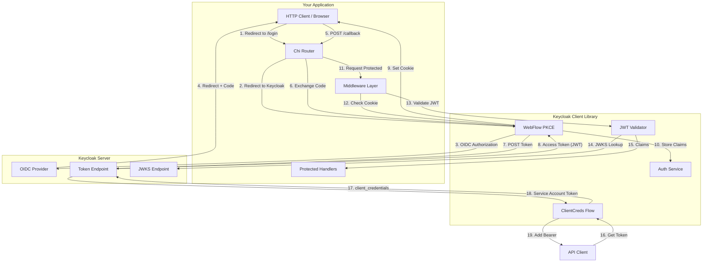
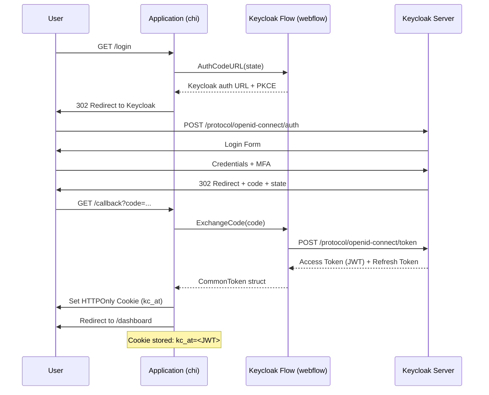
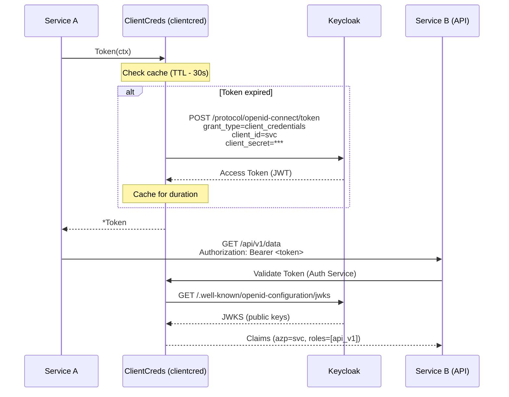
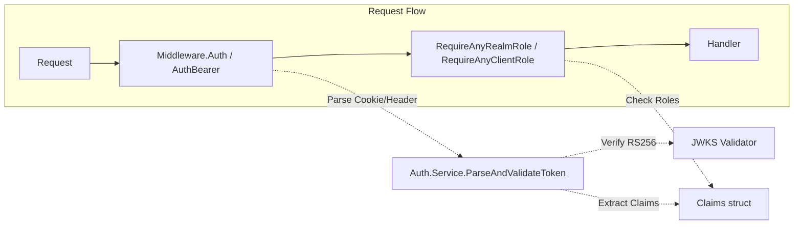

# Architecture: Keycloak v2 Go Client

## Overview

This is a Keycloak OAuth2/OIDC client library for Go with support for:
- **Web Flow** (Authorization Code + PKCE) — user login via browser
- **Client Credentials** — machine-to-machine authentication (API to API)
- **Chi Middleware** — seamless integration with `go-chi/chi` router

---

## Component Architecture



---

## Flow 1: Web Authentication (OAuth2 PKCE)

Used when human users login via browser.

### Sequence Diagram



### Key Components

**`webflow.Flow`**
- Generates PKCE challenge (code verifier/challenge)
- Builds authorization URL: `{issuer}/protocol/openid-connect/auth`
- Exchanges authorization code for token at `/protocol/openid-connect/token`
- Returns `*tokenutil.CommonToken` (Access + Refresh + ExpiresAt)

**`cookieConfig`**
```go
CookieConfig{
    Name:     "kc_at",      // Access token cookie name
    Path:     "/",
    Secure:   true,         // HTTPS only
    HTTPOnly: true,         // No JS access
    SameSite: http.SameSiteLaxMode
}
```

---

## Flow 2: API to API (Client Credentials)

Used when service-to-service communication (no human user).

### Sequence Diagram



### Key Components

**`clientcred.TokenSource`**
- Thread-safe (mutex-protected) token caching
- Auto-refresh when token expires (with 30s buffer)
- Supports refresh_token grant if available
- Returns `*tokenutil.CommonToken`

**Usage in HTTP Client:**
```go
ts := clientcred.NewTokenSource(cfg, nil)
httpClient := &http.Client{
    Transport: clientcred.RoundTripper{
        Base: http.DefaultTransport,
        TS:   ts,
    },
}
```

---

## Flow 3: Middleware & Authorization

### Chi Middleware Layers



### Middleware Types

**1. `Middleware.Auth()`** — Web authentication
- Checks cookie `kc_at`
- If missing → redirect to `/login?return=<current_url>`
- If invalid → clear cookie + redirect to login
- If valid → inject `Claims` into context via `auth.WithClaims()`

**2. `Middleware.AuthBearer()`** — API authentication
- Extracts `Authorization: Bearer <token>` header
- Returns 401 if missing/invalid
- Injects `Claims` into context

**3. `Middleware.RequireAnyRealmRole(roles...)`**
- Checks `claims.RealmAccess.Roles`
- Returns 403 Forbidden if none match

**4. `Middleware.RequireAnyClientRole(clientID, roles...)`**
- Checks `claims.ResourceAccess[clientID].Roles`
- Returns 403 Forbidden if none match

---

## Data Structures

### Claims (JWT Payload)

```go
type Claims struct {
    PreferredUsername string `json:"preferred_username"`
    Email             string `json:"email"`
    RealmAccess       struct {
        Roles []string `json:"roles"`
    } `json:"realm_access"`
    ResourceAccess map[string]struct {
        Roles []string `json:"roles"`
    } `json:"resource_access"`
    AuthorizedParty string `json:"azp"`  // For client_credentials
    jwt.RegisteredClaims
}
```

### CommonToken

```go
type CommonToken struct {
    AccessToken     string    `json:"access_token"`
    TokenType       string    `json:"token_type"`
    ExpiresIn       int64     `json:"expires_in"`
    RefreshToken    string    `json:"refresh_token"`  // Only in webflow
    Scope           string    `json:"scope"`
    ExpiresAt       time.Time `json:"-"`
    RefreshExpiresAt time.Time `json:"-"`
}
```

---

## Security Details

### JWT Validation

1. **Algorithm**: RS256 only (asymmetric, no symmetric secrets)
2. **Issuer**: Validated against `cfg.Issuer()` (Keycloak realm URL)
3. **Signature**: Verified against JWKS from `{issuer}/.well-known/openid-configuration/jwks`
4. **Expiration**: Checked via `RegisteredClaims.ExpiresAt`

### JWKS Caching

Uses `github.com/MicahParks/keyfunc/v3` which:
- Fetches JWKS on startup
- Auto-refreshes when keys rotate
- Caches keys in memory (thread-safe)

### Cookie Security

- **HTTPOnly**: Prevents XSS access to access token
- **Secure**: Only over HTTPS
- **SameSite=Lax**: CSRF protection
- **Short TTL**: Access tokens expire quickly (typically 5-10 min)

---

## Example Usage

### Web Application

```go
// 1. Initialize
flow := webflow.New(cfg, cookieCfg, "/login", "http://localhost/callback", nil)
as, _ := auth.NewService(ctx, cfg)
mw := chiweb.New(as, cfg, flow)

// 2. Routes
r.Get("/login", func(w http.ResponseWriter, r *http.Request) {
    http.Redirect(w, r, flow.AuthCodeURL("state123"), http.StatusFound)
})

r.Get("/callback", chiweb.NewHandler(flow, as, "/").HandleCallback)

// 3. Protected routes
r.Group(func(protected chi.Router) {
    protected.Use(mw.Auth())
    protected.Use(mw.RequireAnyClientRole("read"))
    protected.Get("/data", handler)
})
```

### API Client

```go
// 1. Token source
ts := clientcred.NewTokenSource(apiCfg, nil)

// 2. HTTP client with auto-refresh
httpClient := &http.Client{
    Transport: clientcred.RoundTripper{Base: http.DefaultTransport, TS: ts},
}

// 3. Make request
resp, _ := httpClient.Get("http://api-service/protected")
```

---

## File Structure

```
keycloak/
├── auth/
│   ├── claims.go      # JWT claims + role checking
│   ├── context.go     # Context injection helpers
│   └── service.go     # Token validation + JWKS
├── chi/
│   ├── handler.go     # Callback handler
│   └── middleware.go  # Auth/AuthBearer/Require* middlewares
├── clientcred/
│   ├── client.go      # HTTP RoundTripper
│   └── clientcred.go  # Token caching + fetching
├── tokenutil/
│   └── tokenutil.go   # Token parsing
├── config.go          # Keycloak config struct
└── cmd/server/        # Full working example
```

---

## Dependencies

| Package | Purpose |
|---------|---------|
| `github.com/go-chi/chi/v5` | HTTP router |
| `github.com/golang-jwt/jwt/v5` | JWT parsing |
| `github.com/MicahParks/keyfunc/v3` | JWKS handling |
| `github.com/isklv/slogging` | Structured logging |

---

*Generated: 2026-05-06 | Version: v2*