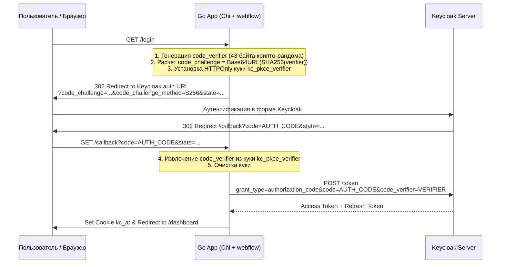

# TODO & Техническая спецификация улучшений Keycloak v2 Go Client

Данный документ содержит детальный анализ требований спецификаций **OAuth 2.0 / 2.1**, **OpenID Connect Core 1.0** и документации **Keycloak**, а также технический план реализации задач **2, 3 и 4**.

---

## Статус задач проекта

- [x] **Задача 1: Безопасность — удаление захардкоженного секрета из `cmd/server/main.go`** (Выполнено в v2.2.0)
- [x] **Задача 2: Исправление логики валидации `azp` (Authorized Party)** (Выполнено в v2.2.0)
- [x] **Задача 3: Полноценная поддержка PKCE (RFC 7636 / OAuth 2.1)** (Выполнено в v2.2.0)
- [x] **Задача 4: Защита от Login CSRF и строгая валидация `state`** (Выполнено в v2.2.0)
- [x] **Задача 5: Тестирование с локальными RSA-ключами и JWKS-сервером** (Выполнено в v2.2.0: `auth` — 95.9%, `chi` — 95.1%, `webflow` — 66.3%)

---

## Задача 2: Исправление логики валидации `azp` (Authorized Party)

### 1. Требования спецификаций и документации Keycloak
- **OIDC Core 1.0 (Section 3.1.3.7 — ID Token Validation)**:
  > *"If an azp (authorized party) Claim is present, the Client MUST verify that its client_id is the Claim Value."*  
  > *"If the ID Token contains multiple audiences, the Client MUST verify that an azp Claim is present."*
- **Keycloak Token Implementation**:
  Keycloak всегда автоматически добавляет клейм `azp` в выданные токены (как access token, так и id token). Значением `azp` является `client_id` того OAuth-клиента, которому сервер Keycloak выпустил данный токен (например, `web` для браузерного пользователя или `svc` для сервисного аккаунта в flow `client_credentials`).
- **Сценарий использования `Config.AuthorizedParties`**:
  В API-шлюзах и защищенных микросервисах настройка `AuthorizedParties: []string{"frontend", "billing-svc"}` означает: **принимать токены только от доверенных клиентов**. Если токен выпущен неизвестным клиентом или клиентом не из белого списка, доступ должен быть строго запрещен (`401/403`).

### 2. Текущая проблема в кодовой базе
В [`auth/service.go`](file:///home/isklv/orca/keycloak/auth/service.go#L59):
```go
// ТЕКУЩИЙ КОД:
if len(s.cfg.AuthorizedParties) > 0 && claims.AuthorizedParty != "" {
    allowed := false
    for _, azp := range s.cfg.AuthorizedParties {
        if azp == claims.AuthorizedParty {
            allowed = true
            break
        }
    }
    if !allowed {
        return nil, fmt.Errorf("%w: expected one of %v, got %q", ErrInvalidAZP, s.cfg.AuthorizedParties, claims.AuthorizedParty)
    }
}
```
**Уязвимость/дефект**: Условие `&& claims.AuthorizedParty != ""` приводит к тому, что если список разрешенных сторон настроен, но в токене поле `azp` **отсутствует или пусто**, проверка полностью пропускается, и невалидный токен успешно проходит авторизацию!

### 3. Требуемая логика (Матрица решений)

| `AuthorizedParties` в конфиге | Клейм `azp` в токене | Результат проверки |
| :--- | :--- | :--- |
| Пустой (по умолчанию) | Любой или отсутствует | **PASS** (валидация `azp` отключена) |
| `["svc", "web"]` | `"svc"` | **PASS** (входит в список) |
| `["svc", "web"]` | `"attacker"` | **FAIL** (`ErrInvalidAZP`) |
| `["svc", "web"]` | `""` (пусто или отсутствует) | **FAIL** (`ErrInvalidAZP` — токен обязан содержать `azp`) |

### 4. План реализации
1. Внести изменения в [`auth/service.go`](file:///home/isklv/orca/keycloak/auth/service.go):
   ```go
   if len(s.cfg.AuthorizedParties) > 0 {
       if claims.AuthorizedParty == "" {
           return nil, fmt.Errorf("%w: missing azp claim in token", ErrInvalidAZP)
       }
       allowed := false
       for _, azp := range s.cfg.AuthorizedParties {
           if azp == claims.AuthorizedParty {
               allowed = true
               break
           }
       }
       if !allowed {
           return nil, fmt.Errorf("%w: expected one of %v, got %q", ErrInvalidAZP, s.cfg.AuthorizedParties, claims.AuthorizedParty)
       }
   }
   ```
2. Добавить unit-тест `TestService_ParseAndValidateToken_AZPValidation/MissingAZPWhenConfigured` в [`auth/service_test.go`](file:///home/isklv/orca/keycloak/auth/service_test.go).

---

## Задача 3: Полноценная поддержка PKCE (Proof Key for Code Exchange, RFC 7636)

### 1. Требования спецификаций и документации Keycloak
- **RFC 7636** и черновик стандарта **OAuth 2.1**:
  PKCE защищает поток Authorization Code от перехвата кода авторизации вредоносными приложениями на устройстве клиента или через Referer-утечки. В OAuth 2.1 механизм PKCE объявлен **обязательным** для всех клиентов.
- **Keycloak Documentation (OpenID Connect Clients)**:
  В Keycloak для каждого клиента в консоли администратора доступна настройка:
  `Advanced Settings -> Proof Key for Code Exchange Code Challenge Method`:
  - `S256` (SHA-256) — промышленный стандарт;
  - `plain` — устаревший режим (не рекомендуется);
  - Отключено / опционально.
  
  Если в Keycloak для клиента выбран режим `S256`:
  1. Запрос на авторизацию к `/protocol/openid-connect/auth` **обязан** содержать:
     - `code_challenge=<base64url(sha256(verifier))>`
     - `code_challenge_method=S256`
     При их отсутствии Keycloak вернет ошибку: `invalid_request: Missing parameter: code_challenge`.
  2. Запрос на обмен кода на токены к `/protocol/openid-connect/token` **обязан** содержать:
     - `code_verifier=<verifier>`
     Если `code_verifier` не совпадает с захэшированным `code_challenge`, Keycloak вернет ошибку `invalid_grant: PKCE verification failed`.

### 2. Текущая проблема в кодовой базе
- В [`ARCHITECTURE.md`](file:///home/isklv/orca/keycloak/ARCHITECTURE.md#L61) указано: *"Web Flow (Authorization Code + PKCE)"* и *"Generates PKCE challenge"*.
- В [`webflow/webflow.go`](file:///home/isklv/orca/keycloak/webflow/webflow.go) метод `AuthCodeURL` формирует только стандартные параметры:
  `client_id`, `response_type=code`, `redirect_uri`, `scope`, `state`.
- Параметры PKCE отсутствуют. Интеграция с Keycloak-клиентами с включенным PKCE в настоящий момент падает с ошибкой.

### 3. Техническое решение



### 4. План реализации

1. **Генератор PKCE в пакете `webflow`** (или `tokenutil`):
   ```go
   type PKCEPair struct {
       Verifier  string // 43-128 символов (base64url)
       Challenge string // base64url(sha256(verifier))
       Method    string // "S256"
   }

   func GeneratePKCE() (*PKCEPair, error) {
       b := make([]byte, 32)
       if _, err := rand.Read(b); err != nil {
           return nil, err
       }
       verifier := base64.RawURLEncoding.EncodeToString(b)
       h := sha256.Sum256([]byte(verifier))
       challenge := base64.RawURLEncoding.EncodeToString(h[:])
       return &PKCEPair{
           Verifier:  verifier,
           Challenge: challenge,
           Method:    "S256",
       }, nil
   }
   ```
2. **Обновление `webflow.Flow`**:
   - Метод `AuthCodeURLWithPKCE(state string, challenge string)` (или опциональная структура параметров `AuthCodeOptions`).
   - Метод `ExchangeCodeWithPKCE(ctx context.Context, code string, verifier string)` — добавление `form.Set("code_verifier", verifier)`.
3. **Хранение в `chi/handler.go`**:
   - При редиректе на логин сохранять `code_verifier` в безопасную временную HTTPOnly cookie `kc_pkce_verifier` (TTL: 5 минут, `SameSite: Lax`, `Secure: true`).
   - В `HandleCallback` считывать куку `kc_pkce_verifier`, передавать ее значение в `ExchangeCodeWithPKCE`, после чего удалять куку (`MaxAge: -1`).
4. **Обратная совместимость**:
   Сохранить базовый метод `ExchangeCode(ctx, code)` для клиентов без PKCE, вызывая внутри `ExchangeCodeWithPKCE(ctx, code, "")`.

---

## Задача 4: Защита от Login CSRF и строгая валидация `state`

### 1. Требования спецификаций и описание вектора атаки
- **RFC 6749 Section 10.12 (Cross-Site Request Forgery)**:
  Клиент обязан использовать параметр `state` для привязки ответа авторизации к конкретной пользовательской сессии.
- **Вектор атаки Login CSRF**:
  1. Злоумышленник инициирует вход в систему под своим аккаунтом Keycloak и перехватывает `code` из редиректа `/callback?code=ATTACKER_CODE`.
  2. Злоумышленник подсовывает этот URL жертве (через фишинговую ссылку или внедренный `` / `<iframe>`).
  3. Если приложение не проверяет `state`, сервер приложения обменивает `ATTACKER_CODE` на токен и авторизует жертву под учетной записью злоумышленника.
  4. Все последующие действия жертвы (ввод конфиденциальных данных, загрузка файлов, платежные реквизиты) происходят в аккаунте злоумышленника.
- **Поведение Keycloak**:
  Keycloak принимает параметр `state` в запросе к `/protocol/openid-connect/auth` и без изменений возвращает его клиенту в строке запроса redirect URI: `/callback?code=...&state=...`.

### 2. Текущее состояние в кодовой базе
В [`chi/handler.go`](file:///home/isklv/orca/keycloak/chi/handler.go#L28):
```go
func (h *Handler) HandleCallback(w http.ResponseWriter, r *http.Request) {
    q := r.URL.Query()
    code := q.Get("code")
    if code == "" {
        http.Error(w, "missing code", http.StatusBadRequest)
        return
    }
    // ВНИМАНИЕ: state полностью игнорируется!
    tok, err := h.flow.ExchangeCode(r.Context(), code)
    ...
```
В [`cmd/server/main.go`](file:///home/isklv/orca/keycloak/cmd/server/main.go#L97) генерируется статический `state := "random-state"`, но при возврате в `/callback` он никак не верифицируется.

### 3. Техническое решение
1. **Генерация случайного `state`**:
   - При редиректе на логин генерируется криптографически стойкий `state` (16–32 случайных байта в `hex` или `base64url`).
   - `state` записывается в защищенную куку `kc_state` (`HttpOnly: true`, `SameSite: Lax`, `Secure: true`, `MaxAge: 300` [5 минут]).
2. **Проверка в `HandleCallback`**:
   - Извлекается `stateQuery := r.URL.Query().Get("state")`.
   - Извлекается значение из куки `stateCookie, err := r.Cookie("kc_state")`.
   - Если кука отсутствует, пуста, или `subtle.ConstantTimeCompare([]byte(stateQuery), []byte(stateCookie.Value)) != 1`:
     - Очистить куку `kc_state`.
     - Вернуть ошибку `http.StatusBadRequest` (или `http.StatusForbidden`) с текстом `invalid or missing OAuth state parameter`.
   - При совпадении — очистить куку `kc_state` и продолжить обмен кода.

---

## Архитектурное объединение задач 3 и 4 (OAuth Transient State)

Вместо создания двух независимых кук (`kc_state` и `kc_pkce_verifier`) рекомендуется объединить их в единую сессию авторизации — **Transient OAuth Cookie**:

### Структура `OAuthSession`:
```go
type OAuthSession struct {
    State        string `json:"state"`
    CodeVerifier string `json:"code_verifier,omitempty"`
    ReturnURL    string `json:"return_url,omitempty"`
    CreatedAt    int64  `json:"created_at"`
}
```

### Преимущества единой транзитной куки:
1. **Атомарность**: `state`, `code_verifier` и целевой `return_url` (куда вернуть пользователя после успешного входа) упаковываются в одну подписанную/зашифрованную HMAC куку `kc_oauth_txn`.
2. **Устранение открытого `return` в query**: адрес возврата не виден третьим лицам и защищен от Open Redirect атак.
3. **Минимум HTTP-заголовков `Set-Cookie`**: браузер получает всего одну транзитную куку на время входа, которая удаляется сразу в обработчике `/callback`.
